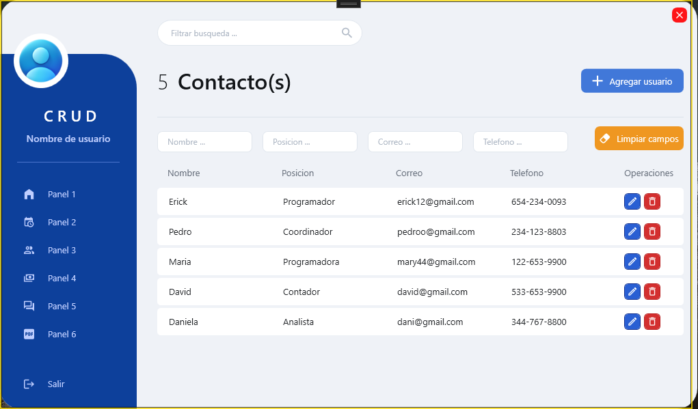

# Administrador de usuarios (CRUD)

El objetivo principal al crear de este proyecto es crear un CRUD(Create, Read, Update and Delete), para el registro y control de usuarios haciendo uso de WPF, con el fin de que el proyecto sea una aplicacion de escritorio, haciendo uso de tecnologias como XAML para el diseño(FrontEnd), mientras que para el BackEnd se usaron tecnologias como SQL Server, Dapper como ORM y C#.

## Screenshots

## Tech Stack

**Client:** WPF, XAML
**Server:** SqlServer, Dapper, C#

